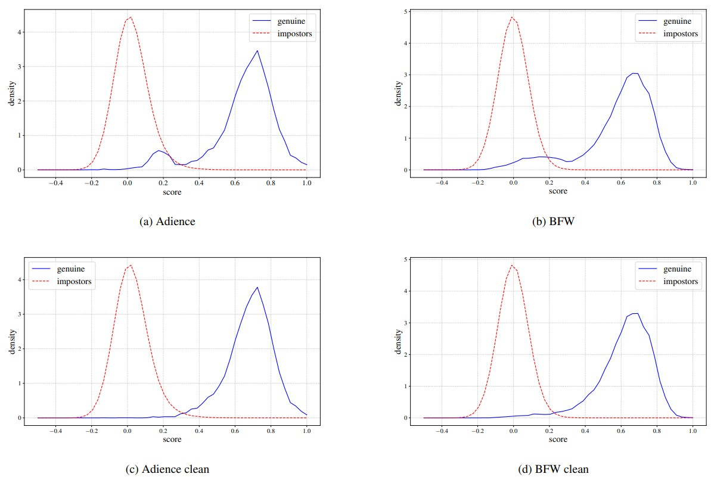

# Embedding Aggregation for Forensic Face Comparison

This is the repository for the accompanying data for the paper [Embedding Aggregation for Forensic Face Comparison](https://arxiv.org/abs/2305.00352).

## Cleaned versions of the Adience and BFW datasets

Both the Adience and BFW datasets have errors in their identity labels. We offer a cleaned version of these datasets. The image below (Fig. 3 in the paper) shows the distributions of genuine and impostor scores from the original and cleaned versions of the datasets.

The images included in each cleaned dataset are listed in the corresponding csv file (adience_clean_list.csv and bfw_clean_list.csv). These csv files have three columns: a sequence number, the identity associated to each image, and the image file name. All other images from the corresponding dataset should be disconsidered. Details on how the datasets were cleaned are in the Section 4.2.2 of the [paper](https://arxiv.org/abs/2305.00352).

To obtain the original datasets, please go to:
- Adience: https://talhassner.github.io/home/projects/Adience/Adience-data.html
- BFW: https://github.com/visionjo/facerec-bias-bfw

## New verification protocol for the Quis-Campi dataset

The Quis-Campi encounters protocol is available at the quis-campi_encounters.csv file. This file has six columns: a sequence number, the path of the image file, the time stamp, the corresponding identity, the typeID, and the encounter number. The typeID for all images in the CSV is 14, indicating that this is a PTZ still image. The encounter number is used to distinguish the multiple encounters of each person with the image capture system.
